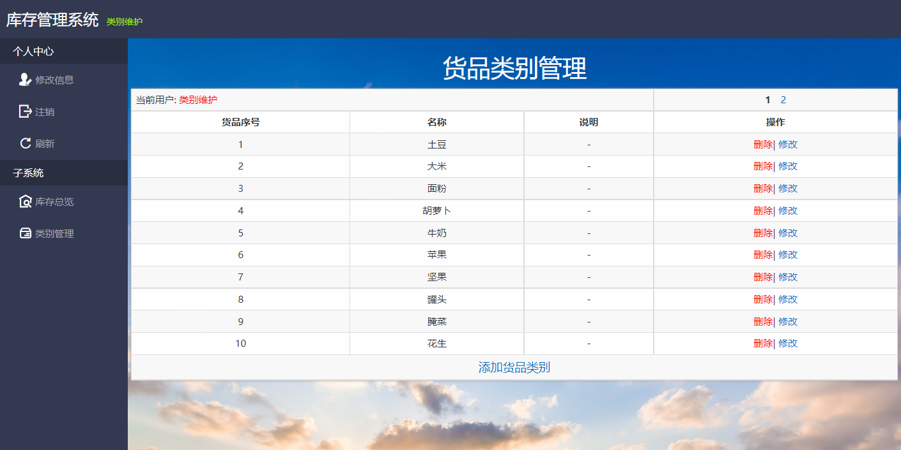
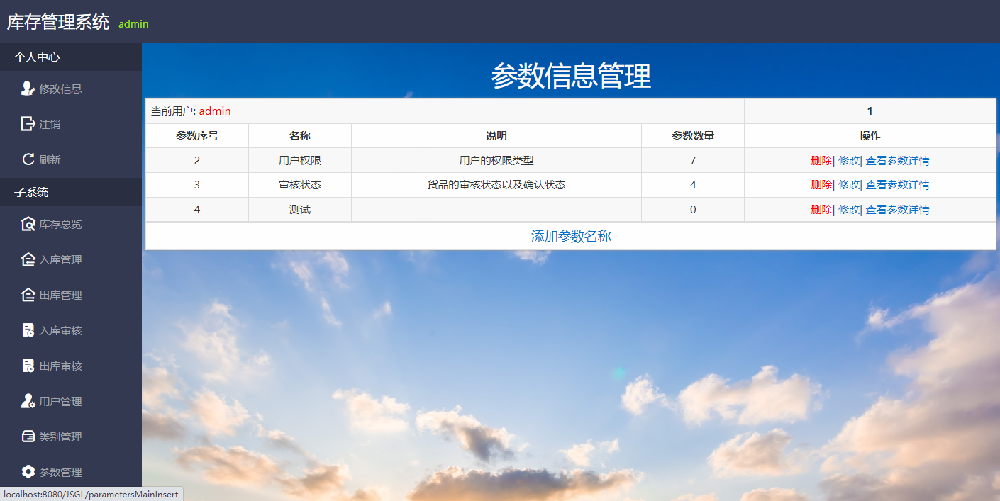

# 库存系统
## 系统功能分析  
&emsp;&emsp;系统角色分为七种，分别为入库管理员、入库审核员、出库管理员、出库审核员、用户管理员、货品类别维护员和超级管理员。   
### 入库管理员用例图
  
### 入库审核员用例图
  
### 出库管理员用例图
  
### 出库审核员用例图
  
### 用户管理员用例图
  
### 货品类别维护员用例图
  
### 超级管理员用例图
  


## 流程分析
### 系统架构图
  

### 数据库关系图  
   

### ER图  
   

## 数据库设计  
### 库存单信息表（inventory）   
&emsp;&emsp;库存清单信息表主要有库存清单编号、货品编号、用户编号、数量、存储位置、信息说明、出入库状态、创建时间、审核状态这9个字段:  
| 字段名称        | 数据类型     | 长度  | 是否允许空 | 是否为主键 | 字段描述    |
|-------------|----------|-----|-------|-------|---------|
| iid         | int      | 11  | 否     | 是     | 库存清单编号  |
| gid         | int      | 11  | 否     | 否     | 外键，货品编号 |
| uid         | int      | 11  | 否     | 否     | 外键，用户编号 |
| quantity    | int      | 11  | 否     | 否     | 数量      |
| location    | varchar  | 255 | 否     | 否     | 存储位置    |
| explanation | varchar  | 255 | 否     | 否     | 信息说明    |
| status      | int      | 11  | 否     | 否     | 出入库状态   |
| createTime  | datetime | 0   | 否     | 否     | 创建时间    |
| review      | int      | 11  | 否     | 否     | 审核状态    |

### 货品信息表（goods）  
&emsp;&emsp;货品类别信息表主要有货品类别编号、货品类别名称、货品类别说明这3个字段:  
| 字段名称        | 数据类型    | 长度  | 是否允许空 | 是否为主键 | 字段描述   |
|-------------|---------|-----|-------|-------|--------|
| gid         | int     | 11  | 否     | 是     | 货品类别编号 |
| name        | varchar | 255 | 否     | 否     | 货品类别名称 |
| explanation | varchar | 255 | 是     | 否     | 货品类别说明 |

### 用户信息表（user）  
&emsp;&emsp;用户信息表主要有用户编号、用户名称、用户密码、电话号码、权限等级、用户状态这6个字段:
| 字段名称     | 数据类型    | 长度  | 是否允许空 | 是否为主键 | 字段描述 |
|----------|---------|-----|-------|-------|------|
| uid      | int     | 11  | 否     | 是     | 用户编号 |
| name     | varchar | 255 | 否     | 否     | 用户名称 |
| password | varchar | 255 | 否     | 否     | 用户密码 |
| phone    | varchar | 255 | 是     | 否     | 电话号码 |
| rank     | varchar | 255 | 是     | 否     | 权限等级 |
| status   | varchar | 255 | 是     | 否     | 用户状态 |

### 库存审核信息表（inventory_review）  
&emsp;&emsp;库存审核信息表主要有库存审核编号、库存单编号、用户编号、审核说明这4个字段:  
| 字段名称        | 数据类型    | 长度  | 是否允许空 | 是否为主键 | 字段描述      |
|-------------|---------|-----|-------|-------|-----------|
| irid        | int     | 11  | 否     | 是     | 库存审核编号    |
| iid         | int     | 11  | 否     | 否     | 外键，库存清单编号 |
| uid         | int     | 11  | 否     | 否     | 外键，用户编号   |
| explanation | varchar | 255 | 是     | 否     | 审核说明      |

### 参数信息表（parameters_main）  
&emsp;&emsp;参数信息表主要有参数名称编号、参数名称、参数说明这3个字段:
| 字段名称        | 数据类型    | 长度  | 是否允许空 | 是否为主键 | 字段描述   |
|-------------|---------|-----|-------|-------|--------|
| pmid        | int     | 11  | 否     | 是     | 参数名称编号 |
| name        | varchar | 255 | 否     | 否     | 参数名称   |
| explanation | varchar | 255 | 是     | 否     | 参数说明   |

### 参数键值信息表（parameters_sub）  
&emsp;&emsp;参数键值信息表主要有参数键值编号、参数编号、参数键、参数值、参数键值说明这5个字段:
| 字段名称        | 数据类型    | 长度  | 是否允许空 | 是否为主键 | 字段描述    |
|-------------|---------|-----|-------|-------|---------|
| psid        | int     | 11  | 否     | 是     | 参数键值编号  |
| pmid        | int     | 11  | 否     | 否     | 外键，参数编号 |
| name        | varchar | 255 | 否     | 否     | 参数键     |
| value       | varchar | 255 | 否     | 否     | 参数值     |
| explanation | varchar | 255 | 是     | 否     | 参数键值说明  |


## 功能实现与说明  
## 系统登录  
&emsp;&emsp;所有用户都通过此页面登录系统。点击登录后前台页面会校验用户输入的数据格式的正确性，正确后会将数据转入后台。首先会验证验证码是否正确，若验证码错误了，则系统会反馈信息“登录失败，验证码错误”到前台。验证码输入正确通过验证后，会将对输入的内容进行检查，无误后会进入主页，若检查出错则系统会反馈信息“登录失败”到前台。  
  
## 系统主页  
&emsp;&emsp;除了用户权限为用户管理员以外的用户在登录系统后都会转到主页，该页面侧边栏聚合了当前用户可以使用的系统功能模块，同时聚合了用户的个人中心。登录后该功能才会启用，且允许除了用户权限为用户管理员以外的用户权限的用户进行访问与使用。进入系统主页后会默认显示库存总览模块页面，该页面聚合了当前库存的聚合信息，包括货品的名称、数量、最后修改时间和主要位置，个人中心具有三个功能，分别是修改信息、注销以及刷新，修改信息是指维护用户自己的账号信息，注销是指退出当前账号的登录状态，刷新会重置当前框架内的页面。  
  
## 用户修改信息  
&emsp;&emsp;当用户点击侧边栏的个人中心分类下的修改信息模块时，将转到用户信息修改页面，该页面能够更改用户的用户名称、用户密码、联系电话，用户权限由专门的角色进行管理，一般用户无法自行更改用户权限。登录后该功能才会启用，且允许持有任意用户权限的用户进行访问与使用。当按下修改后前台页面会校验用户输入的数据格式的正确性，包括非空判断，新密码与确认密码是否相同，正确后会将数据转入后台。后台会查询原密码的一致性。若不一致将提示“原密码错误”，如果一致则进行用户姓名查重。若名称重复则提示“用户名称已存在，请重新输入”，若不重复则执行修改用户信息操作，修改操作执行成功后，系统会注销用户的登录状态，并要求用户重新登录。  
 
 

## 查看货品详情
&emsp;&emsp;当用户在库存总览模块页面点击一个货品后的查看详情链接时，将转到货品详细信息页面，该页能看到指定货品的详细信息，包括清单号、入库员、数量、以及存放位置和创建时间。登录后该功能才会启用，且允许除了用户权限为用户管理员以外的用户权限的用户进行访问与使用。  
  

## 入库管理  
&emsp;&emsp;当用户点击侧边栏的子系统分类下的入库管理模块时，将转到入库清单管理页面，该页面能够看到当前用户下待处理的入库清单信息，包括清单号、货品名称、数量、位置、创建时间以及审核状态。该页面还具有添加货品入库清单、删除货品入库清单、修改货品入库清单、以及确认审核消息的功能。登录后该功能模块及其下属功能才会启用，整个入库管理功能模块只允许用户权限为入库管理员或超级管理员的用户进行访问与使用。  
 
  

&emsp;&emsp;当用户在入库清单管理页面点击添加货品入库清单链接时，将转到添加货品入库清单页面，该页面具有添加货品入库清单的功能。用户需要选择货品，并填写数量、说明和位置，点击添加按钮后前台页面会校验用户输入的数据格式的正确性，包括非空验证、数字验证和非负验证，验证正确后会将数据转入后台。  
 
  

&emsp;&emsp;当用户在入库清单管理页面点击一个入库清单后的确认消息链接时，将转到审核结果页面，该页面可以反馈入库审核员对货品入库清单的审核说明，一般情况下审核状态为审核通过或审核未通过才能使用该功能。用户可以确认消息后点击确认消息按钮，点击确认消息按钮后，系统会提示“确认消息后此清单会隐藏，是否确认？”，当用户选择确认则表示执行该操作，确认消息后该入库清单将会在入库管理中隐藏，表示该货品已完成入库操作，但只有审核通过才能执行该操作。若审核状态为审核未通过，用户点击确认消息则会直接返回入库清单管理页面。  
 
  

&emsp;&emsp;当用户在入库清单管理页面点击一个入库清单后的修改链接时，将转到修改货品入库清单页面，该页面具有修改货品入库清单的功能。一般情况下审核状态为审核中或审核未通过才能使用该功能。用户可以修改货品、数量、位置和说明，点击修改按钮后前台页面会校验用户输入的数据格式的正确性，包括非空验证、数字验证和非负验证，验证正确后会将数据转入后台。审核未通过的货品入库清单修改后审核状态会变为审核中，重新进入审核流程。  
 
  

&emsp;&emsp;当用户在入库清单管理页面点击一个入库清单后的删除链接时，将执行删除入库清单功能。一般情况下审核状态为审核中或审核未通过才能使用该功能。用户点击一个入库清单后的删除链接后将二次进行确认，防止误操作，点击确定后才会执行删除功能。  
 

## 入库审核  
&emsp;&emsp;当用户点击侧边栏的子系统分类下的入库审核模块时，将转到入库清单审核管理页面，该页面能够看到需要审核的入库清单信息，包括清单号、货品名称、入库员、数量、位置、创建时间以及审核状态。该页面还具有审核入库清单功能。登录后该功能模块及其下属功能才会启用，整个入库审核功能模块且只允许用户权限为入库审核员或超级管理员的用户进行访问与使用。  
 
  

&emsp;&emsp;当用户在入库清单审核管理页面点击一个入库清单后的审核链接时，将转到指定清单的入库清单审核页面，该页面具有审核货品入库清单的功能，当用户需要重新修改对某个入库清单的审核信息时，也可以使用本模块功能。一般情况下审核状态为审核中或审核未通过才能使用该功能，若已通过审核则会直接不在入库清单审核模块显示。登录后该功能才会启用，且只允许用户权限为入库审核员或超级管理员的用户进行访问与使用。用户需要审核入库清单，并给予合适的审核状态和审核说明，点击提交审核按钮后前台页面会校验用户输入的数据格式的正确性，验证正确后会将数据转入后台。  
 
  

## 出库管理  
&emsp;&emsp;当用户点击侧边栏的子系统分类下的出库管理模块时，将转到出库清单管理页面，该页面能够看到当前用户下待处理的出库清单信息，包括清单号、货品名称、数量、位置、创建时间以及审核状态。该页面还具有添加货品出库清单、删除货品出库清单、修改货品出库清单、以及确认审核消息的功能。登录后该功能模块及其下属功能才会启用，整个出库管理功能模块只允许用户权限为出库管理员或超级管理员的用户进行访问与使用。  
 
  

&emsp;&emsp;当用户在出库清单管理页面点击添加货品入库清单链接时，将转到选择出库货品页面，该页面具有选择出库货品的功能。用户需要选择需要出库的货品，并点击货品后的查看详情链接进行选择。  
 
  

&emsp;&emsp;点击查看详情链接后将转到货品详细信息页面，该页面具有显示货品的详细信息功能。用户选择货品单后，并点击货品单后的出库链接进行选择。  
 
   

&emsp;&emsp;点击出库链接后将转到添加货品出库清单页面，该页面具有添加货品出库清单的功能。用户需要填写出库数量和出库说明，点击添加按钮后前台页面会校验用户输入的数据格式的正确性，包括非空验证、数字验证、非负验证以及判断是否大于已有数量，验证正确后会将数据转入后台。    
 
  

&emsp;&emsp;当用户在出库清单管理页面点击一个出库清单后的确认消息链接时，将转到审核结果页面，该页面可以反馈出库审核员对货品出库清单的审核说明，一般情况下审核状态为审核通过或审核未通过才能使用该功能。用户可以确认消息后点击确认消息按钮，点击确认消息按钮后，系统会提示“确认消息后此清单会隐藏，是否确认？”，当用户选择确认则表示执行该操作，确认消息后该出库清单将会在出库管理中隐藏，表示该货品已完成出库操作，这个操作的前提是审核通过。若审核状态为审核未通过，用户点击确认消息则会直接返回出库清单管理页面。  
 
 

&emsp;&emsp;当用户在出库清单管理页面点击一个出库清单后的修改链接时，将转到修改货品出库清单页面，该页面具有修改货品出库清单的功能。一般情况下审核状态为审核中或审核未通过才能使用该功能。用户可以修改货品出库数量和出库说明，点击修改按钮后前台页面会校验用户输入的数据格式的正确性，包括非空验证、数字验证、非负验证以及判断是否大于已有数量，验证正确后会将数据转入后台。审核未通过的货品出库清单修改后审核状态会变为审核中，重新进入审核流程。  
 
 

&emsp;&emsp;当用户在出库清单管理页面点击一个出库清单后的删除链接时，将执行删除出库清单功能。一般情况下审核状态为审核中或审核未通过才能使用该功能。  
## 出库审核  
&emsp;&emsp;当用户点击侧边栏的子系统分类下的出库审核模块时，将转到出库清单审核管理页面，该页面能够看到需要审核的出库清单信息，包括清单号、货品名称、出库员、数量、位置、创建时间以及审核状态。该页面还具有审核出库清单功能。登录后该功能模块及其下属功能才会启用，整个出库审核功能模块只允许用户权限为出库审核员或超级管理员的用户进行访问与使用。  
 
 

&emsp;&emsp;当用户在出库清单审核管理页面点击一个出库清单后的审核链接时，将转到指定清单的出库清单审核页面，该页面具有审核货品出库清单的功能，当用户需要重新修改对某个出库清单的审核信息时，也可以使用本模块功能。一般情况下审核状态为审核中或审核未通过才能使用该功能，若已通过审核则会直接不在出库清单审核模块显示。用户需要审核出库清单，并给予合适的审核状态和审核说明，点击提交审核按钮后前台页面会校验用户输入的数据格式的正确性，验证正确后会将数据转入后台。  
 
 
## 用户管理  
&emsp;&emsp;当用户点击侧边栏的子系统分类下的用户管理模块时，将转到用户管理页面，该页面具有用户管理的功能，且会展示信息，包括UID、用户名称、联系电话和用户权限。该页面还具有添加用户、删除用户、重置用户密码、以及修改用户权限的功能。登录后该功能模块及其下属功能才会启用，整个用户管理功能模块只允许用户权限为用户管理员或超级管理员的用户进行访问与使用。且当用户权限为用户管理员时不能对用户权限为超级管理员和同级权限的用户进行任何操作。  
 
 
&emsp;&emsp;当用户在用户管理页面点击添加用户链接时，将转到添加用户页面，该页面具有添加用户的功能。当用户权限为用户管理员时不能赋予待添加的用户超级管理员权限。用户需要填写名称、密码和联系电话，并选择合适的权限，点击添加按钮后前台页面会校验用户输入的数据格式的正确性，包括非空判断以及密码与确认密码是否相同，验证正确后会将数据转入后台。首先会对用户姓名查重，若名称重复则提示“添加用户失败，名称重复”，若不重复则执行添加用户信息操作。  

&emsp;&emsp;当用户在用户管理页面点击一个用户信息后的删除链接时，将执行删除用户功能。  

&emsp;&emsp;当用户在用户管理页面点击一个用户信息后的重置密码链接时，将执行重置用户密码功能。用户点击一个用户信息后的重置密码链接后系统会提示用户“你确定要重置XX的密码吗？”，当用户二次确认后才会执行重置用户密码功能，重置用户密码功能会将指定用户的密码重置为用户名称。  

&emsp;&emsp;当用户在入库清单管理页面点击一个用户信息后的修改权限链接时，将转到用户权限修改页面，该页面具有修改用户权限的功能。当用户权限为用户管理员时不能赋予待修改的用户超级管理员权限。用户可以修改指定用户的权限，点击修改按钮后前台页面会校验用户输入的数据格式的正确性，包括非空验证，验证正确后会将数据转入后台。  
 
## 类别管理  
当用户点击侧边栏的子系统分类下的类别管理模块时，将转到货品类别管理页面，该页面能够看到货品类别信息，包括货品序号、名称和说明。该页面还具有添加货品类别、删除货品类别、以及修改货品类别的功能。登录后该功能模块及其下属功能才会启用，整个类别管理功能模块只允许用户权限为货品类别维护员或超级管理员的用户进行访问与使用。  
 
 

&emsp;&emsp;当用户在货品类别管理页面点击添加货品类别链接时，将转到添加货品类别页面，该页面具有添加货品类别的功能。用户需要填写名称和说明，点击添加按钮后前台页面会校验用户输入的数据格式的正确性，包括非空判断，验证正确后会将数据转入后台。首先会对名称查重，若名称重复则提示“添加货品类别失败，名称重复，请重新输入”，若不重复则执行添加货品类别信息操作。   
&emsp;&emsp;当用户在货品类别管理页面点击一个货品类别信息后的删除链接时，将执行删除货品类别功能。用户点击一个货品类别信息后的删除链接后将二次进行确认，防止误操作。点击确定后才会执行删除功能，并且只有在该货品类别没有被使用的情况下才能成功删除。若已经有货品清单使用了该货品类别，则无法执行删除，并且会提示用户“删除失败，该货品类别已经被使用”。   

&emsp;&emsp;当用户在货品类别管理页面点击一个货品类别信息后的修改链接时，将转到修改货品类别页面，该页面具有修改货品类别信息的功能。用户可以修改货品类别的名称或说明，点击修改按钮后前台页面会校验用户输入的数据格式的正确性，包括非空验证，验证正确后会将数据转入后台。首先会对名称查重，若名称重复则提示“名称已存在，请重新输入”，若不重复则执行修改货品类别信息操作。  
 
## 参数管理  
&emsp;&emsp;当用户点击侧边栏的子系统分类下的参数管理模块时，将转到参数信息管理页面，该页面能够查看当前系统使用的参数信息，包括参数序号、参数名称、参数说明，以及参数的数量。该页面还具有添加参数名称信息、删除参数名称信息、修改参数名称信息，以及查看参数详情的功能。登录后该功能模块及其下属功能才会启用，整个参数管理功能模块只允许用户权限为超级管理员的用户进行访问与使用。  
 
 

&emsp;&emsp;当用户在参数信息管理页面点击添加参数名称链接时，将转到添加参数名称页面，该页面具有添加参数名称的功能，参数名称是用来对参数进行分组，一个参数名称下有一组参数数据。用户需要填写名称和说明，点击添加按钮后前台页面会校验用户输入的数据格式的正确性，包括非空判断，验证正确后会将数据转入后台。首先会对名称查重，若名称重复则提示“添加参数名称失败，名称重复”，若不重复则执行添加参数名称操作。  

&emsp;&emsp;当用户在参数信息管理页面点击一个参数信息后的删除链接时，将执行删除参数名称功能。用户点击一个参数信息后的删除链接后，系统会先检查该参数名称下的参数数量是否为零，即没有参数，若不为零则系统会提示“该参数名称下存在参数，请先删除参数”，若为零则将二次进行确认，防止误操作，点击确定后才会执行删除功能。  

&emsp;&emsp;当用户在参数信息管理页面点击一个参数信息后的修改链接时，将转到修改参数名称页面，该页面具有修改参数名称的功能。用户可以修改参数的名称或说明，点击修改按钮后前台页面会校验用户输入的数据格式的正确性，包括非空验证，验证正确后会将数据转入后台。首先会对名称查重，若名称重复则提示“名称已存在，请重新输入”，若不重复则执行修改参数名称操作。  
 
&emsp;&emsp;当用户在参数信息管理页面点击一个参数信息后的查看参数详情链接时，将转到对应参数名称的键值管理页面，该页面能够查看对应参数名称的键值信息，包括名称也就是键、值，以及键值说明。该页面还具有添加键值、删除键值，以及修改键值的功能。登录后该功能模块及其下属功能才会启用，整个键值管理功能模块只允许用户权限为超级管理员的用户进行访问与使用。  
 
 

&emsp;&emsp;当用户在键值管理页面点击添加键值链接时，将转到添加键值页面，该页面具有添加键值的功能。用户需要填写名称、值和说明，点击添加按钮后前台页面会校验用户输入的数据格式的正确性，包括非空判断，验证正确后会将数据转入后台。会对名称与值都进行查重，若名称或值重复则提示“添加键值失败，名称或值重复，请重新输入”，若不重复则执行添加键值操作。  
 
&emsp;&emsp;当用户在键值管理页面点击一个键值信息后的删除链接时，将执行删除键值功能。  

&emsp;&emsp;当用户在键值管理页面点击一个键值信息后的修改链接时，将转到修改键值页面，该页面具有修改键值的功能。用户可以修改键值的名称、值，以及说明，点击修改按钮后前台页面会校验用户输入的数据格式的正确性，包括非空验证，验证正确后会将数据转入后台。会对名称与值都进行查重，若名称或值重复则提示“修改键值失败，名称或值已存在，请重新输入”，若不重复则执行修改键值操作。  


## 工具类
### [MySql.java](src/com/dao/MySql.java)  
&emsp;&emsp;使用数据库语句的封装,用以更新或者查询数据库内容,频繁使用.将返回的结果通过List,LinkedHashMap封装后返回,并封装有分页方法.  
### [Tools.java](src/com/aotmd/Tools.java)    
&emsp;&emsp;工具类:用以辅助,删除数组中的元素并重构数组  
### [Translate.java](src/com/aotmd/Translate.java)
&emsp;&emsp;翻译类:映射数据库字段在前端显示的文字  
### [LoginFilter.java](src/com/aotmd/LoginFilter.java)
&emsp;&emsp;全局登录拦截:第一个执行,未登陆账号则进入login,并且兼任全局修改编码类型为utf-8.  
### [RankFilter.java](src/com/aotmd/RankFilter.java)
&emsp;&emsp;权限拦截:第二个执行,用以限定各个页面的权限控制.    
### [CaptchaController.java](src/com/controller/CaptchaController.java)
&emsp;&emsp;使用Graphics2D动态绘制验证码,验证码图片大小可动态调整.  

## 使用技术:
&emsp;&emsp;网页使用的技术：JavaScript、Bootstrap、JQuery、JSP、JSTL、阿里图标库；  
&emsp;&emsp;后台使用的技术：Spring、Spring MVC、MyBatis  
&emsp;&emsp;数据库使用： MySQL  
&emsp;&emsp;IDE使用：IntelliJ IDEA  
&emsp;&emsp;Web服务器：apache-tomcat  


## 项目依赖  
aspectjweaver-1.8.13.jar  
mybatis-3.5.4.jar  
log4j-core-2.13.0.jar  
spring-web-5.0.2.RELEASE.jar  
spring-core-5.0.2.RELEASE.jar  
spring-context-5.0.2.RELEASE.jar  
spring-webmvc-5.0.2.RELEASE.jar  
javassist-3.26.0-GA.jar  
mysql-connector-java-**5.1.7**-bin.jar  
spring-beans-5.0.2.RELEASE.jar  
log4j-1.2.17.jar  
spring-jdbc-5.0.2.RELEASE.jar  
spring-aop-5.0.2.RELEASE.jar  
cglib-3.3.0.jar  
log4j-api-2.13.0.jar  
servlet-api.jar  
commons-dbcp2-2.7.0-tests.jar  
spring-expression-5.0.2.RELEASE.jar  
ognl-3.2.12.jar  
spring-tx-5.0.2.RELEASE.jar  
javax.el-3.0.1-b08.jar  
commons-io-2.6.jar  
commons-pool2-2.8.0-tests.jar  
commons-dbcp2-2.7.0.jar  
taglibs-standard-impl-1.2.5.jar  
spring-orm-5.0.2.RELEASE.jar  
javax.persistence.jar  
commons-pool2-2.8.0.jar  
asm-7.1.jar  
commons-fileupload-1.4.jar  
mybatis-spring-2.0.4.jar  
jboss-logging-3.3.0.Final.jar  
classmate-1.3.1.jar  
validation-api-1.1.0.Final.jar  
jsp-api.jar  
commons-logging-1.2.jar  
javax.ejb.jar  
javax.resource.jar  
slf4j-api-1.7.30.jar  
spring-aspects-5.0.2.RELEASE.jar  
taglibs-standard-spec-1.2.5.jar  
javax.servlet.jsp.jstl.jar  
javax.jms.jar  
slf4j-log4j12-1.7.30.jar  
javax.transaction.jar  
javax.annotation.jar  
aopalliance-1.0.jar  

&emsp;&emsp;其中**mysql-connector-java-5.1.7-bin.jar**的版本尤为重要，因为本系统使用的fmt标签库支持的是**java.sql.Timestam**。  
而新的mysql驱动对于数据库表字段类型为**datetime**的数据会封装为**java.time.LocalDateTime**类型,而不是旧驱动的**java.sql.Timestam**类型。  
&emsp;&emsp;老的mysql驱动包还无法连接mysql版本为8.0以上的mysql，mysql8.0之前的版本加密规则是**mysql_native_password**，mysql8.0之后，加密规则是**caching_sha2_password**。  
可以在 MySQL 8.0 以上版本中创建一个用户并手动将其密码设置为旧的加密规则（mysql_native_password），以便与旧的驱动程序兼容。  
&emsp;&emsp;当然，安装8.0版本以下的MySQL可以避免这个操作。也可以参考[这里](https://acteds.github.io/2023/05/17/MySQL%E7%9A%84%E9%A9%B1%E5%8A%A8%E7%89%88%E6%9C%AC%E6%9B%B4%E6%9B%BF%E5%90%8E%E6%97%A5%E6%9C%9F%E8%BF%94%E5%9B%9E%E5%80%BC%E7%9A%84%E5%8F%98%E5%8C%96/) 进行修改。  

## 其他  
&emsp;&emsp;[数据库文件](演示/inventory_system.sql)

## License
```
                Copyright 2023 by acteds

   Licensed under the Apache License, Version 2.0 (the "License");
   you may not use this file except in compliance with the License.
   You may obtain a copy of the License at

       http://www.apache.org/licenses/LICENSE-2.0

   Unless required by applicable law or agreed to in writing, software
   distributed under the License is distributed on an "AS IS" BASIS,
   WITHOUT WARRANTIES OR CONDITIONS OF ANY KIND, either express or implied.
   See the License for the specific language governing permissions and
   limitations under the License.
```